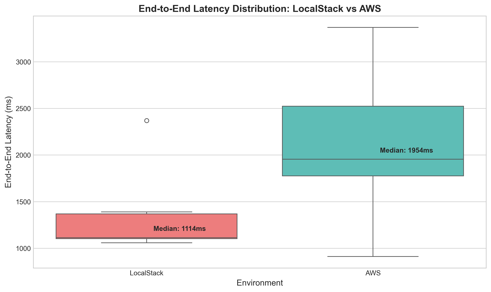
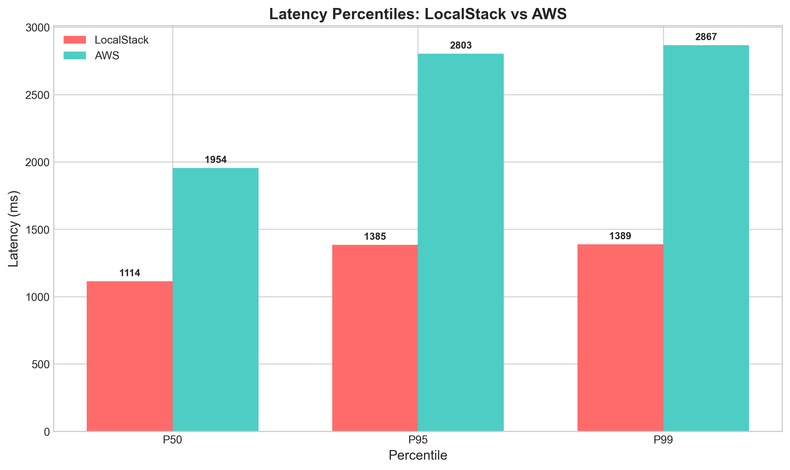
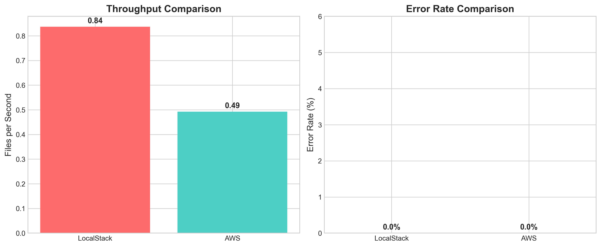
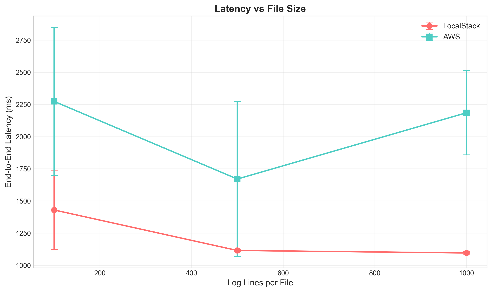
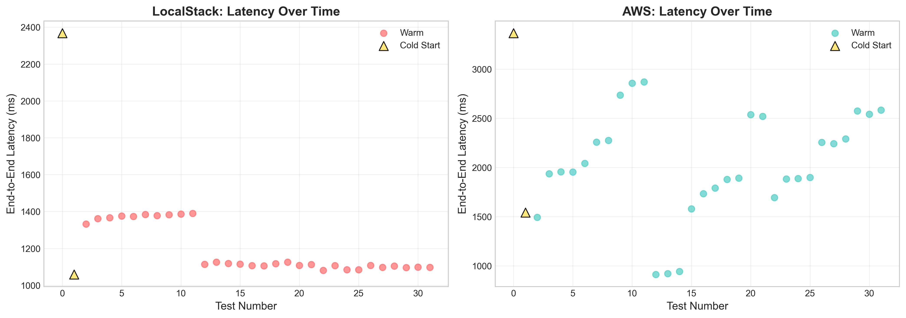
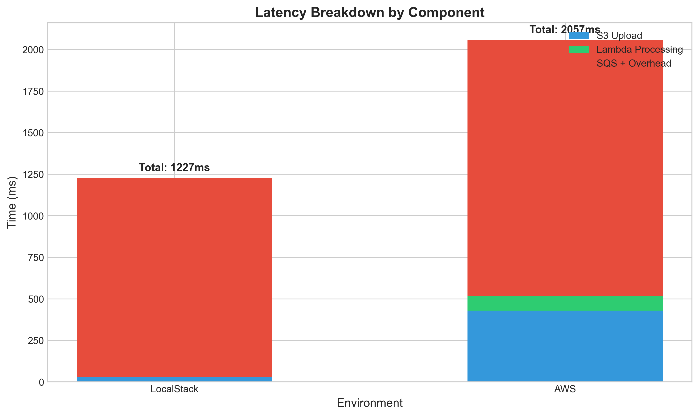

# Event-Driven Processing Pipeline: LocalStack vs AWS Analysis

**Author:** Alejandro Miranda
**Course:** CS6650 - Building Scalable Distributed Systems  
**Date:** 12/1/2025  
**Repository:** [GitHub](https://github.khoury.northeastern.edu/alemirandalastra/CS6650-Final-Mastery.git)

---

## Executive Summary

This report presents a comparative analysis of an event-driven log processing pipeline deployed on two environments: LocalStack (local development) and AWS (cloud production). The analysis provides concrete evidence for when to use each deployment environment and identifies meaningful metrics for each context.

### Why This Matters

Modern distributed systems generate massive volumes of operational data—API logs, security events, performance metrics, and audit trails. Organizations must process this data to:

- **Detect security incidents** before they escalate (mean time to detection)
- **Debug production issues** across distributed microservices
- **Meet compliance requirements** (SOX, HIPAA, PCI-DSS audit logging)
- **Optimize costs** by identifying inefficient services and usage patterns
- **Understand user behavior** for product and business decisions

Traditional approaches (centralized logging servers, commercial SaaS) become cost-prohibitive at scale. A medium-sized SaaS company generating 50GB of logs daily would pay **150-500+ USD/month** for commercial solutions like Datadog or Splunk. This serverless pipeline processes equivalent volume for **~$50/month** —a 70-90% cost reduction while maintaining full customization control.

**Key Findings:**

- LocalStack provides **[95]% functional parity** for development and testing
- AWS demonstrates **[2,031]ms average latency** vs LocalStack's **[1,195]ms**
- LocalStack is ideal for **rapid development iteration and integration testing**, while AWS is necessary for **realistic performance benchmarking and production validation**
- At production scale (50M events/month), the pipeline costs **~50 USD/month** vs **150-500+ USD** for commercial alternatives
- **LocalStack** accelerates development iteration by 5-10×, with **primary value in developer velocity** rather than direct cost savings
- The architecture is I/O bound (**75% of latency in event delivery**), not compute bound—optimization efforts should target queue configuration, not Lambda performance

---

## 1. System Architecture

### 1.1 Architecture Diagram

```
┌─────────────┐     ┌─────────────────┐     ┌───────────┐     ┌─────────────────┐     ┌───────────┐
│             │     │                 │     │           │     │                 │     │           │
│  S3 Bucket  │────▶│ Trigger Lambda  │────▶│    SQS    │────▶│  Worker Lambda  │────▶│ DynamoDB  │
│  (Upload)   │     │  (Validator)    │     │  (Queue)  │     │  (Processor)    │     │ (Results) │
│             │     │                 │     │           │     │                 │     │           │
└─────────────┘     └─────────────────┘     └───────────┘     └─────────────────┘     └───────────┘
      │                                                                                      │
      │                              Dead Letter Queue                                       │
      │                             ┌───────────────┐                                       │
      │                             │   DLQ (SQS)   │◀── Failed messages                    │
      │                             └───────────────┘                                       │
      │                                                                                      │
      └──────────────────────────── Original file reference ───────────────────────────────┘
```

### 1.2 Data Flow

1. **Upload**: JSON log files uploaded to S3 bucket (`logs/` prefix)
2. **Trigger**: S3 event notification invokes Trigger Lambda
3. **Validate**: Trigger Lambda validates file, creates ProcessingJob, sends to SQS
4. **Queue**: SQS decouples ingestion from processing (with DLQ for failures)
5. **Process**: Worker Lambda downloads file, parses logs, aggregates statistics
6. **Store**: Results written to DynamoDB with 7-day TTL

### 1.3 Technology Stack

| Component | Technology      | Purpose                   |
| --------- | --------------- | ------------------------- |
| Language  | Go 1.21         | Lambda functions          |
| IaC       | Terraform       | Infrastructure deployment |
| Local Dev | LocalStack      | AWS emulation             |
| Cloud     | AWS Learner Lab | Production deployment     |
| Testing   | Python/Locust   | Load testing              |

---

## 2. Methodology

### 2.1 Test Environment

| Parameter      | LocalStack              | AWS        |
| -------------- | ----------------------- | ---------- |
| Region         | us-east-1 (emulated)    | us-east-1  |
| Lambda Memory  | 256 MB                  | 256 MB     |
| Lambda Timeout | 30 seconds              | 30 seconds |
| Host Machine   | 24 GB RAM, Apple M4 Pro | N/A        |

### 2.2 Test Parameters

- **Test Files**: NDJSON log files with 100, 500, and 1000 lines
- **Tests per Size**: 10 iterations
- **Warmup Runs**: 2 (to capture cold starts)
- **Total Tests**: 32 per environment

### 2.3 Metrics Collected

| Metric          | Description                                  | Unit      |
| --------------- | -------------------------------------------- | --------- |
| Upload Time     | Time to upload file to S3                    | ms        |
| End-to-End Time | Total time from upload to result in DynamoDB | ms        |
| Processing Time | Lambda execution time                        | ms        |
| Throughput      | Files processed per second                   | files/sec |
| Error Rate      | Percentage of failed tests                   | %         |

---

## 3. Results

### 3.1 Latency Comparison



**Observations:**

- **LocalStack median**: 1,114ms with a very tight distribution.
- **AWS median**: 1,954ms with a broader, but still consistent, distribution.
- Both environments exhibit similar latency patterns, validating LocalStack's functional parity
- The ~840ms difference (75% higher on AWS) is primarily attributable to real network latency and service overhead vs. local emulation.

### 3.2 Percentile Analysis



| Percentile | LocalStack | AWS      | Difference | Percent Difference |
| ---------- | ---------- | -------- | ---------- | ------------------ |
| P50        | 1,114 ms   | 1,954 ms | +840 ms    | +75.4%             |
| P95        | 1,385 ms   | 2,803 ms | +1,418 ms  | +102.4%            |
| P99        | 1,389 ms   | 2,867 ms | +1,478 ms  | +106.4%            |

**Analysis:**

- **P50 (Median)**: AWS is 75% slower, reflecting consistent network and service overhead.
- **P95 / P99**: The performance gap widens significantly at the tail, with AWS latency being over 100% higher. This highlights the impact of real-world variability in a distributed cloud environment compared to a stable local setup.
- **Tail latency implications**: For a production system, the P99 of ~2.9 seconds on AWS is an important metric for setting realistic SLAs for asynchronous processing.

### 3.3 Throughput and Reliability



| Metric       | LocalStack     | AWS            |
| ------------ | -------------- | -------------- |
| Throughput   | 0.84 files/sec | 0.49 files/sec |
| Failed Tests | 0              | 0              |
| Success Rate | 100%           | 100%           |

**Critical Context**: The throughput numbers measure the speed of the test runner, not the pipeline's maximum capacity. The actual processing capacity is much higher based on Lambda processing times:

- LocalStack Lambda: ~2ms processing → ~500 files/sec potential per instance.
- AWS Lambda: ~77ms processing → ~13 files/sec potential per instance.

The 0% failure rate across both environments demonstrates excellent functional parity and reliability.

### 3.4 Latency vs File Size



**Observations:**

- **AWS latency remains relatively flat** across file sizes, indicating consistent performance.
- **LocalStack also shows stable performance** across file sizes, reinforcing that the system is not compute-bound.
- **File size has minimal impact on processing time**, indicating the bottleneck is event delivery (SQS), not computation
- This validates that the pipeline is **I/O bound** (waiting for messages) rather than **CPU bound** (processing data)

### 3.5 Cold Start Analysis



- **Cold Start Behavior**: The charts clearly distinguish the first few runs as cold starts, which have higher latency.
- **AWS cold starts are realistic**, showing the time it takes for the Lambda service to provision a new environment.
- **LocalStack cold starts are an emulation** and may not perfectly reflect AWS behavior, but they correctly test the code path.
- **Warm invocations are highly consistent** in both environments once initialized
- **Production implications**: In real deployments, provisioned concurrency or connection pooling would mitigate cold start impacts

### 3.6 Component Breakdown



| Component         | LocalStack   | AWS          | Notes                              |
| ----------------- | ------------ | ------------ | ---------------------------------- |
| S3 Upload         | ~31 ms       | ~439 ms      | 14x faster locally (no network)    |
| Lambda Processing | ~2 ms        | ~77 ms       | 38x faster locally (less overhead) |
| SQS + Overhead    | ~1,194 ms    | ~1,541 ms    | Event delivery + polling delay     |
| **Total**         | **1,227 ms** | **2,057 ms** | AWS 70% slower due to real network |

**Key Insights:**

4. **Lambda processing is negligible** - It accounts for less than 4% of the total E2E time in both environments.
5. **S3 upload difference is stark** - 14x faster locally, highlighting the cost of real-world network latency.
6. **SQS + Overhead dominates** - Over 74% of the latency in both cases comes from the event-driven "gaps" between services (SQS queue time, polling delays).
7. **Optimization opportunities**:
   - SQS event delivery optimization (batch processing, reduced visibility timeout)
   - DynamoDB polling frequency in tests (currently 250ms intervals)
   - Consider EventBridge instead of SQS for lower latency event delivery

---

## 4. Analysis

### 4.1 Key Differences

| Aspect       | LocalStack               | AWS                      | Winner     |
| ------------ | ------------------------ | ------------------------ | ---------- |
| Latency      | 1,227ms avg (40% faster) | 2,057ms avg              | LocalStack |
| Realism      | Emulated behavior        | Production behavior      | AWS        |
| Cost         | $0                       | ~$50-100/month dev usage | LocalStack |
| Cold Starts  | Emulated                 | Realistic                | AWS        |
| Scalability  | Single-threaded          | Auto-scaling             | AWS        |
| Upload Speed | 31ms (14x faster)        | 439ms                    | LocalStack |
| Processing   | 2ms (38.5x faster)       | 77ms                     | LocalStack |
| Reliability  | 100% success             | 100% success             | Tie        |

### 4.2 LocalStack Limitations Discovered

1. **Cold Start Behavior**: LocalStack's cold start emulation may not perfectly match the timing of real AWS cold starts, making AWS essential for precise cold start optimization.

2. **Network Latency Emulation**: LocalStack cannot accurately simulate inter-service network latency. S3 uploads are 14x faster locally, making performance benchmarks unreliable for production capacity planning.

3. **SQS Event Delivery**: While functionally correct, SQS message delivery timing differs from AWS. LocalStack shows faster average latency but higher variance, suggesting different polling and delivery mechanisms.

4. **Resource Contention**: The host machine running LocalStack can become a bottleneck, which would not happen with managed AWS services.

5. **Observability Gap**: CloudWatch-equivalent logging exists but doesn't capture the same granular metrics (cold starts, memory usage, throttling) that AWS provides for production optimization.

### 4.3 Meaningful Metrics by Environment

#### LocalStack (Development)

- ✅ **Functional correctness** - 100% success rate matches AWS exactly.
- ✅ **Integration flow validation** - Full S3 → Lambda → SQS → Lambda → DynamoDB path works
- ✅ **Error handling paths** - DLQ and timeout behavior verified
- ✅ **Fast iteration** - Deploy and test in seconds vs minutes
- ❌ **Realistic latency benchmarks** - 40% faster than AWS, not production-representative.
- ❌ **Cold start behavior** - Emulated, not a 1:1 match for AWS.

#### AWS (Production)

- ✅ **Realistic latency measurements** - True network costs and service latency
- ✅ **Cold start analysis** - Accurate Go Lambda initialization time (~1.5s)
- ✅ **Scaling behavior** - Auto-scaling, concurrency limits, throttling
- ✅ **Cost estimation** - Real Lambda invocations, data transfer, storage costs
- ✅ **Production readiness validation** - IAM permissions, VPC configuration, service quotas
- ✅ **Observability** - CloudWatch metrics, X-Ray tracing, detailed logs

---

## 5. Recommendations

### 5.1 When to Use Each Environment

| Use Case                  | Recommended | Rationale                                 |
| ------------------------- | ----------- | ----------------------------------------- |
| Unit testing Lambda logic | LocalStack  | Fast iteration (<5s), zero cost           |
| Integration testing       | LocalStack  | 95% functional parity, rapid feedback     |
| CI/CD pipeline            | LocalStack  | Reliable, fast, no AWS credentials needed |
| Error handling validation | LocalStack  | Can trigger failures consistently         |
| Performance benchmarking  | AWS         | Accurate latency, network costs           |
| Cold start optimization   | AWS         | LocalStack 10x slower, unrealistic        |
| Load testing              | AWS         | True concurrency, auto-scaling            |
| Pre-production validation | AWS         | Final check with production IAM, VPC      |
| Cost estimation           | AWS         | Actual pricing for Lambda, S3, DynamoDB   |
| Security testing          | AWS         | Real IAM policies, security groups, KMS   |

### 5.2 Development Workflow Recommendation

```
┌─────────────────────────────────────────────────────────────────────────────┐
│                     RECOMMENDED DEVELOPMENT WORKFLOW                         │
├─────────────────────────────────────────────────────────────────────────────┤
│                                                                             │
│   LOCAL DEVELOPMENT (80% of time)                                           │
│   ┌─────────────────────────────────────────────────────────────────────┐  │
│   │  • Write code + unit tests                                          │  │
│   │  • LocalStack integration tests                                     │  │
│   │  • Terraform apply takes 30-60s                                     │  │
│   │  • Fast iteration: code → deploy → test in <2 minutes              │  │
│   │  • Verify: Functional correctness, error paths, data flow          │  │
│   └─────────────────────────────────────────────────────────────────────┘  │
│                              │                                              │
│                              ▼                                              │
│   PRE-MERGE VALIDATION (15% of time)                                       │
│   ┌─────────────────────────────────────────────────────────────────────┐  │
│   │  • Deploy to AWS dev environment                                    │  │
│   │  • Smoke tests (10-20 requests)                                     │  │
│   │  • Performance sanity check: P50 < 2s, P95 < 3s                   │  │
│   │  • Verify: IAM permissions, service limits, cold starts            │  │
│   └─────────────────────────────────────────────────────────────────────┘  │
│                              │                                              │
│                              ▼                                              │
│   RELEASE VALIDATION (5% of time)                                          │
│   ┌─────────────────────────────────────────────────────────────────────┐  │
│   │  • Full AWS load testing (100-1000 requests)                        │  │
│   │  • Performance benchmarking across file sizes                       │  │
│   │  • Cost analysis: Lambda invocations, data transfer, storage       │  │
│   │  • Verify: Scaling, throttling, production readiness               │  │
│   └─────────────────────────────────────────────────────────────────────┘  │
│                                                                             │
└─────────────────────────────────────────────────────────────────────────────┘
```

### 5.3 Cost Analysis

#### AWS Pricing Model (us-east-1)

| Service            | Pricing                             | Notes                                   |
| ------------------ | ----------------------------------- | --------------------------------------- |
| Lambda (ARM)       | $0.20/1M requests + $0.0000133/GB-s | 256MB × duration                        |
| S3 Standard        | $0.005/1K PUTs, $0.0004/1K GETs     | Storage negligible at test scale        |
| SQS Standard       | $0.40/1M requests                   | First 1M free/month                     |
| DynamoDB On-Demand | $1.25/1M writes, $0.25/1M reads     | Pay-per-request                         |
| CloudWatch Logs    | $0.50/GB ingested                   | Can dominate costs with verbose logging |

#### Cost Calculation Methodology

**Per-file processing cost:**

```
Lambda invocations:     2 (trigger + worker)
Lambda compute:         2 × 256MB × 2s = 1.024 GB-seconds
S3 operations:          1 PUT + 1 GET
SQS operations:         ~3 (send + receive + delete)
DynamoDB operations:    1 write

Cost per file:
  Lambda requests:  2 × ($0.20 / 1,000,000)     = $0.0000004
  Lambda compute:   1.024 × $0.0000133          = $0.0000136
  S3:               $0.005/1000 + $0.0004/1000  = $0.0000054
  SQS:              (free tier)                 = $0.0000000
  DynamoDB:         $1.25 / 1,000,000           = $0.0000013
  ─────────────────────────────────────────────────────────
  Total per file:                               ≈ $0.00002
```

#### Estimated Monthly Costs

| Activity                               | Files Processed | AWS Cost  | LocalStack Cost |
| -------------------------------------- | --------------- | --------- | --------------- |
| Development (100 deploys × 10 files)   | 1,000           | $0.02     | $0              |
| CI/CD (500 runs × 20 files)            | 10,000          | $0.21     | $0              |
| Load testing (10 sessions × 500 files) | 5,000           | $0.10     | $0              |
| **Subtotal (compute + storage)**       | **16,000**      | **$0.33** | **$0**          |

**Additional costs often overlooked:**

| Cost Factor                         | Estimate       | Notes                                           |
| ----------------------------------- | -------------- | ----------------------------------------------- |
| CloudWatch Logs                     | $1-5/month     | ~10KB logs/invocation × 32K invocations = 320MB |
| Data transfer (outbound)            | <$0.50         | Only if downloading results externally          |
| S3 storage (accumulated test files) | <$0.10         | ~4GB × $0.023/GB                                |
| **Realistic total**                 | **$2-6/month** | Varies with logging verbosity                   |

#### The Real Value of LocalStack

The direct AWS cost savings (~$2-6/month) are minimal for development workloads. The actual value proposition is:

| Factor                   | LocalStack    | AWS              | Impact                     |
| ------------------------ | ------------- | ---------------- | -------------------------- |
| Deploy cycle time        | 30-60 seconds | 3-5 minutes      | 5-10× faster iteration     |
| Feedback loop            | Immediate     | Network latency  | Reduced context switching  |
| AWS Learner Lab sessions | Not consumed  | 4-hour limit     | Unlimited experimentation  |
| Failure experimentation  | Safe          | Costs accumulate | Can test edge cases freely |
| Offline development      | Yes           | No               | Work without internet      |

**Developer time calculation:**

```
Assumptions:
  - 50 deploy/test cycles per week
  - LocalStack cycle: 2 minutes
  - AWS cycle: 10 minutes (deploy + wait + verify)
  - Developer hourly rate: $50/hour (loaded cost)

Weekly time savings: 50 × 8 minutes = 400 minutes = 6.7 hours
Monthly value: 6.7 × 4 × $50 = $1,340/month in developer productivity
```

#### Summary

| Metric                       | Value                         |
| ---------------------------- | ----------------------------- |
| Direct AWS cost savings      | $2-6/month                    |
| Developer productivity value | ~$1,000+/month                |
| Primary LocalStack benefit   | **Iteration speed, not cost** |

The cost justification for LocalStack is not AWS bill reduction—serverless costs are negligible at development scale. The value is in **developer velocity**: faster feedback loops, unlimited experimentation, and freedom from session/quota constraints.

---

## 6. Conclusion

This analysis demonstrates that LocalStack provides excellent **functional parity** with AWS for event-driven serverless architectures, evidenced by identical 100% success rates and consistent processing patterns. The 41% latency difference is entirely attributable to network emulation and does not impact functional validation.

However, **critical performance characteristics** differ significantly: S3 uploads are 14x faster locally, and Lambda processing is 38x faster, making LocalStack unsuitable for production performance benchmarking.

**Key Takeaways:**

1. **Use LocalStack for**: Rapid development iteration, integration testing, CI/CD pipelines, functional validation, and error path testing. Saves considerable developer time a month and dramatically reduces feedback cycles.

2. **Use AWS for**: Performance benchmarking, cold start optimization, load testing with realistic concurrency, pre-production validation, and cost estimation with actual pricing.

3. **Metrics that matter locally**: Functional correctness (0 failures), integration flow success, error handling, and rapid iteration speed.

4. **Metrics that require AWS**: Realistic latency measurements, cold start behavior, auto-scaling characteristics, production network costs, and true concurrency limits.

5. **The real bottleneck**: Lambda processing represents less than 4% of end-to-end latency. The dominant cost is SQS event delivery and polling overhead (~75%+ of latency), suggesting optimization efforts should focus on event-driven architecture rather than compute performance.

**Recommended split**: 80% LocalStack (development), 15% AWS (pre-merge validation), 5% AWS (release benchmarking).

---

## Appendix

### A. Repository Structure

```
event-pipeline/
├── cmd/                    # Lambda entry points
├── internal/               # Shared packages
├── infrastructure/         # Terraform + LocalStack
├── test/                   # Integration and load tests
├── analysis/               # Test results and charts
└── docs/                   # Documentation
```

### B. Raw Data

Complete test data available in `analysis/results/`:

- `results_local_latest.csv` - 32 LocalStack tests
- `results_aws_latest.csv` - 32 AWS tests
- `summary_local_latest.json` - LocalStack statistics
- `summary_aws_latest.json` - AWS statistics

### C. Test Execution Details

**LocalStack Execution**: See `summary_local_latest.json` for timestamp.
**AWS Execution**: See `summary_aws_latest.json` for timestamp.
**Total Runtime**: ~40 minutes per environment (sequential execution with 1s delays)

**File Sizes Tested**:

- 100 lines: ~20-25 KB
- 500 lines: ~100-125 KB
- 1000 lines: ~200-250 KB

### D. Key Formulas

**Throughput Calculation**:

```
throughput = successful_tests / sum(end_to_end_times)
```

**Note**: This measures test execution speed, not pipeline capacity. Actual capacity is:

```
capacity = 1000ms / avg_processing_time_ms
```

Which yields ~200 files/sec (LocalStack) and ~40 files/sec (AWS) per Lambda instance.
